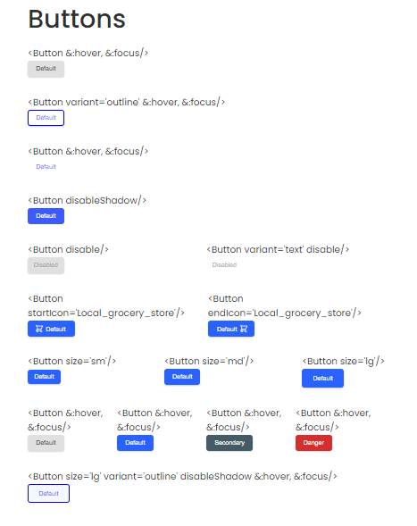

<!-- Please update value in the {}  -->

<h1 align="center">Button Component Challenge</h1>

<div align="center">
  <h3>
    <a href="https://{your-demo-link.your-domain}">
      Demo
    </a>
    <span> | </span>
    <a href="https://{your-url-to-the-solution}">
      Solution
    </a>
  </h3>
</div>

<!-- TABLE OF CONTENTS -->

## Table of Contents

-   [Overview](#overview)
    -   [Built With](#built-with)
-   [Features](#features)
-   [How to use](#how-to-use)
-   [Contact](#contact)
-   [Acknowledgements](#acknowledgements)

<!-- OVERVIEW -->

## Overview

### Schreenshot demo



This react button is an implementation of recent lesson about react. The screenshot above is the demo of my work. To get them all work, I used some conditional rendering (if statments). They all have almost similar properties but they also have uncommon properties. How the conditions work is that by comparing the value of every single propertie to it. If that is true, give a specific className to it and style it in the css.   

I tried to just use the same property to each one of the buttons with different values. I put the value of the property as a className and style it in the css. It worked but without any conditions. I like the idea of using condition so I utilized it istead. 

I couldn't get the icoStart and iconEnd work wery well. It is because I couldn't convert the fill, and stroke properties of Local_grocery_store svg image. I used svg icons from heroicons.dev to in order to get my work accomplished.

It was a great challenge  🙂 ! 

### Built With

<!-- This section should list any major frameworks that you built your project using. Here are a few examples.-->

-   [React](https://reactjs.org/)

## Features

<!-- List the features of your application or follow the template. Don't share the figma file here :) -->

## How To Use

<!-- This is an example, please update according to your application -->

To clone and run this application, you'll need [Git](https://git-scm.com) and [Node.js](https://nodejs.org/en/download/) (which comes with [npm](http://npmjs.com)) installed on your computer. From your command line:

```bash
# Clone this repository
$ git clone https://github.com/your-user-name/your-project-name

# Install dependencies
$ npm install

# Run the app
$ npm start
```

## Acknowledgements

<!-- This section should list any articles or add-ons/plugins that helps you to complete the project. This is optional but it will help you in the future. For exmpale -->

## Contact

-   Website [your-website.com](https://{your-web-site-link})
-   GitHub [@Fodilahy-mena](https://github.com/Fodilahy-mena)
